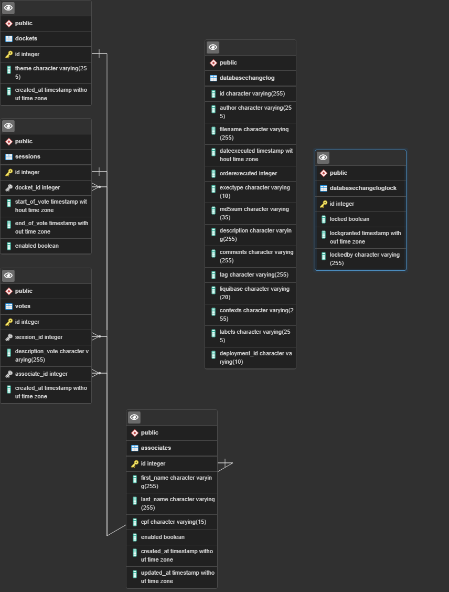
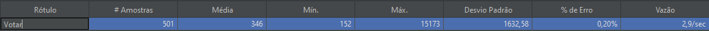
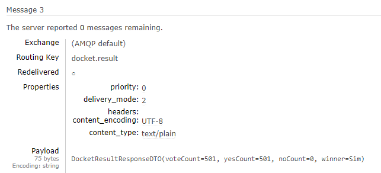
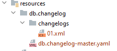

# Client Api

## _Api desenvolvida para avaliação de Desenvolvedor Pleno_

- Api publicada no Heroku disponível em: http://localhost:8080/api/swagger-ui/#/.
- A documentação da Api via Swagger encontra-se disponível em: http://localhost:8080/api/swagger-ui/#/.

## Tecnologias utilizadas:

- Java 17
- Spring 5
- WebClient WebFlux
- PostgreSQL
- RabbitMQ
- JMeter
- Liquibase
- Heroku
- Git Actions

- ##### Conforme solicitado não foi implementado nenhuma segurança.

## Features:

- Criar, Atualizar, Deletar e Listar pautas para votação
- Criar, Atualizar, Deletar e Listar sessões de voto para as pautas
- Criar, Atualizar, Deletar e Listar associados para participarem das votações
- Votar em determinada sessão
- Finalizar o resultado da pauta

## Regras de Negócio:

- Ao criar uma sessão de votação, o usuario pode optar por desabilitar todas outras sessões vinculadas a pauta, caso
  exista.
- Inicio da Votação não é obrigatório, o default é LocalDateTime.now(); [agora]
- Final da Votação não é obrigatório, o default é LocalDateTime.now().plusMinutes(1); [1 min apos o inicio]
- Para sucesso na votação o voto deve respeitar o intervalo de horario
- Descrição dos votos obrigatoriamente deve ser Sim/Não.
- Associado só pode votar 1x na pauta, independente da quantidade de sessões.
- Cpf do associado deve ser válido

# Evidencias

## DER:

  
_Tabelas Databasechangelog/Databasechangeglock são utilizadas pelo Liquibase_

## JMeter:

- Utilizando o JMeter para a Requisição de votação tivemos o seguinte resultado em uma amostra de 501 requisições:
  
  _Apenas 2,9/sec de vazão, lembrando que o serviço faz um consumo externo (validação cpf) em um api hospedada no
  heroku._

## RabbitMQ:

- Finalização do resultado da pauta, com o disparo de evento para o Cloud AMQP.
  

## Versionamento:

- Para a versão a presente aplicação utiliza do Git Hub para o versionamento,
  repositório: https://github.com/luizflavios/client-api
- Para as alterações de banco, usamos Liquibase para criação das migrations arquivadas no caminho
  /resources/db/changelog/changelogs:

  